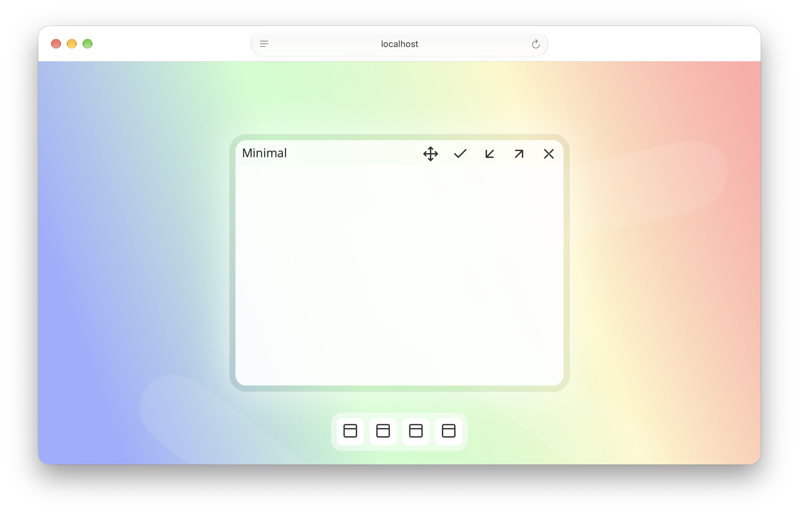
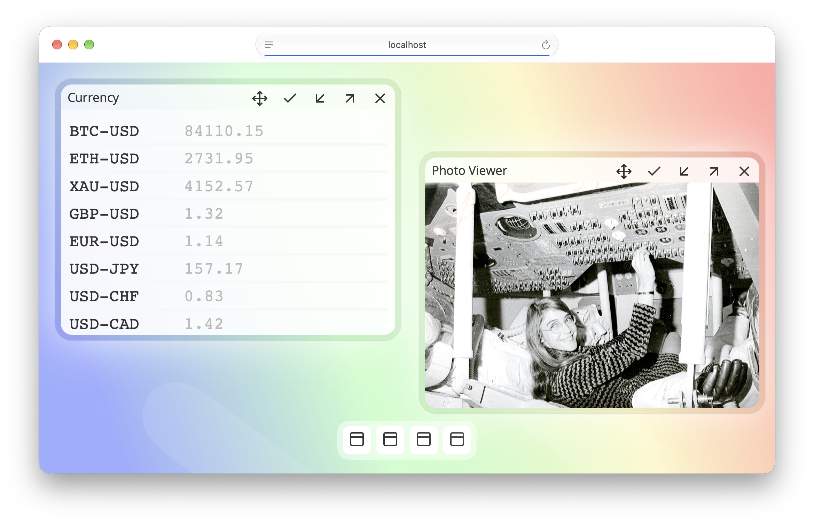

# andromeda
Andromeda operating system for web browser.

A simple program.

```javascript

function createEmptyApp() {
	var main = Screen.createWindow("Minimal")
}	

Screen.registerApp("Empty", e => createEmptyApp())

```




Writing photo viewer.

```javascript

async function createPhotoViewer() {
	var viewer = Screen.createWindow("Photo Viewer")

	var image = document.createElement("img")
	image.src = "/sample-photo.jpg"
	image.style.display = "block"
	image.style.width   = "100%"

	var container = viewer.element.querySelector(".container")
	container.style.padding = 0
	Screen.addElement(viewer, image)
}

Screen.registerApp("Photo View", e => createPhotoViewer())

```


Using AJAX to call web service.

```javascript

function createCurrency() {
	var main = Screen.createWindow("Currency")
	var container = main.element.querySelector(".container")
	container.classList.add("cryptocurrency")

	var css = `
				.cryptocurrency .list {
					padding: .25rem 0;
					border-bottom: .25rem solid #f8f8f8;
					font-family: monospace;
					font-size: 1.5rem;
				}
				.cryptocurrency .light {
					color: #bbb;
					margin-left: 4rem;
				}
			`

	Screen.addStyle(css)

	var items = ["BTC-USD", "ETH-USD", "XAU-USD",
				"GBP-USD", "EUR-USD", "USD-JPY", 
				"USD-CHF", "USD-CAD", "AUD-USD",
				"USD-THB"]

	for (var i = 0; i < items.length; i++) {
		var list = document.createElement("section")
		list.classList.add("list")
		list.classList.add(items[i])
		list.innerHTML = items[i]

		var location = "https://api.coinbase.com" +
						"/v2/prices/" + items[i] + "/spot"
		fetch(location).then( e => e.json() ).then(e => {
			console.log(e)
			var symbol   = e.data.base + "-" + e.data.currency
			var selector = "." + symbol
			var element  = container.querySelector(selector)
			var value    = (+e.data.amount).toFixed(2)
			element.innerHTML = symbol +
								"<span class='light'>" +
								value +
								"</span>"
		})

		Screen.addElement(main, list)
	}
}

Screen.registerApp("Currency", e => createCurrency())

```



